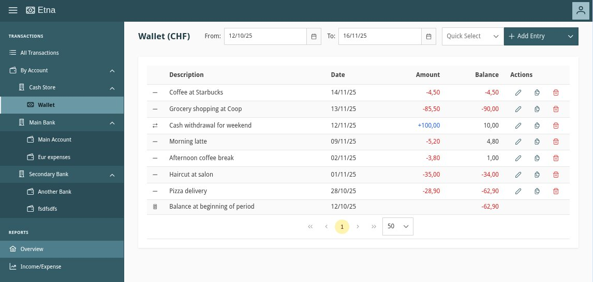
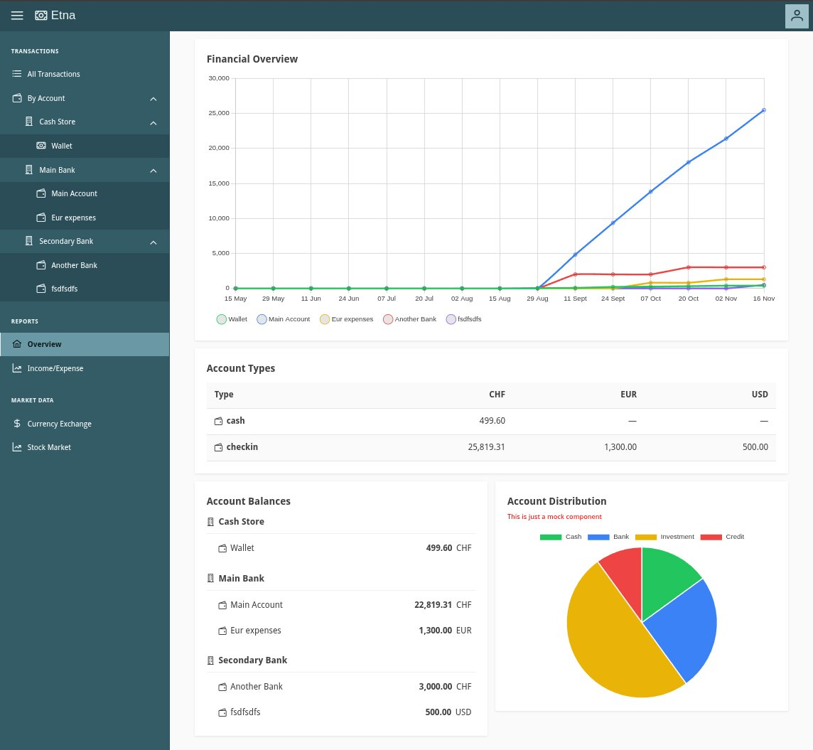

# Etna
Personal finance App


## Screenshots
Account transaction list


Balance overview


## About 
Is an opinionated personal finance app to keep track of personal expenses and investment.

It builds on top of https://github.com/go-bumbu

**Important:** The project is in it's very early stages and not ready to be used


## DEV

### requisites
* golang runtime [https://go.dev/doc/install](https://go.dev/doc/install)
* npm

### Starting the backend

```
go run main.go start
```

Runs without a config file using built-in defaults (auth disabled, no login). Optional: copy `zarf/pkg/deb-config.yaml` to `config.yaml` and customize.

There is a convenient make target `make run`.


### Starting the frontend
```
cd webui
npm run dev
```

### Install sample content
While the backend is up and running (localhost:8085), run:
```
go run zarf/sampleData/*.go
```
This installs sample content. With auth disabled (default), the app is immediately accessible. If auth is enabled, use demo:demo or admin:admin to log in.
