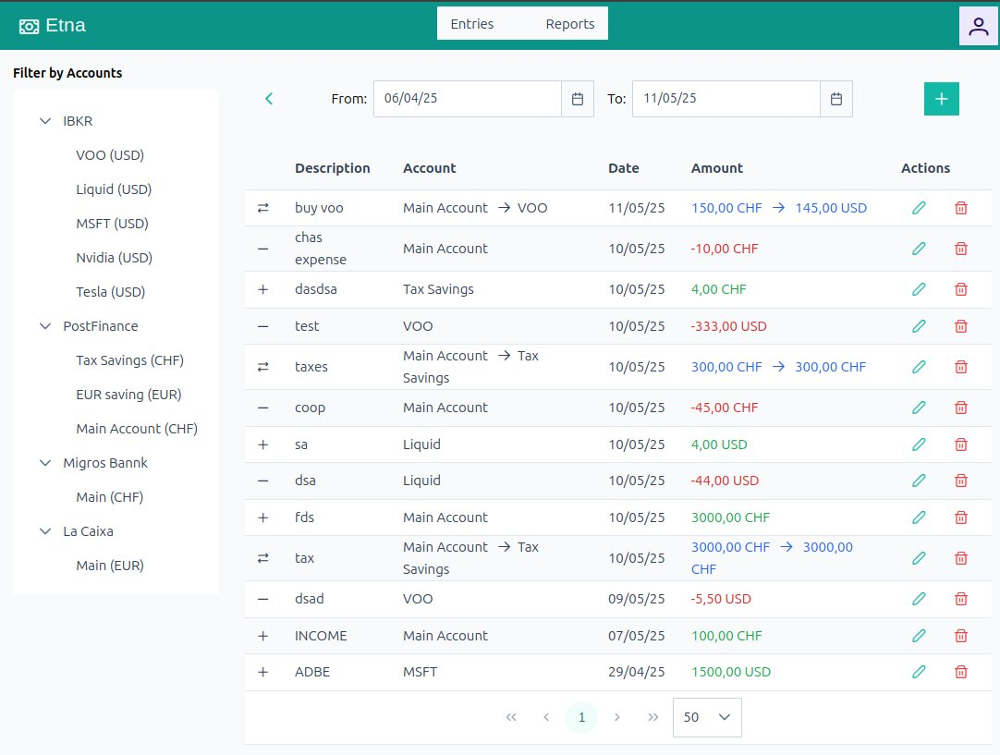

# Etna
Personal finance App



## About 
Is an opinionated personal finance app to keep track of personal expenses and investment.

It builds on top of https://github.com/go-bumbu

**Important:** The project is in it's very early stages and not ready to be used


## DEV

### requisites
* golang runtime [https://go.dev/doc/install](https://go.dev/doc/install)
* npm

### Starting the backend

```
APP_LOG_LEVEL="debug" go run main.go start -c zarf/appData/config.yaml
```

note: there is a convenient make target `make run`


### Starting the frontend
```
cd webui
npm run dev
```

now you can login with demo:demo or admin:admin
